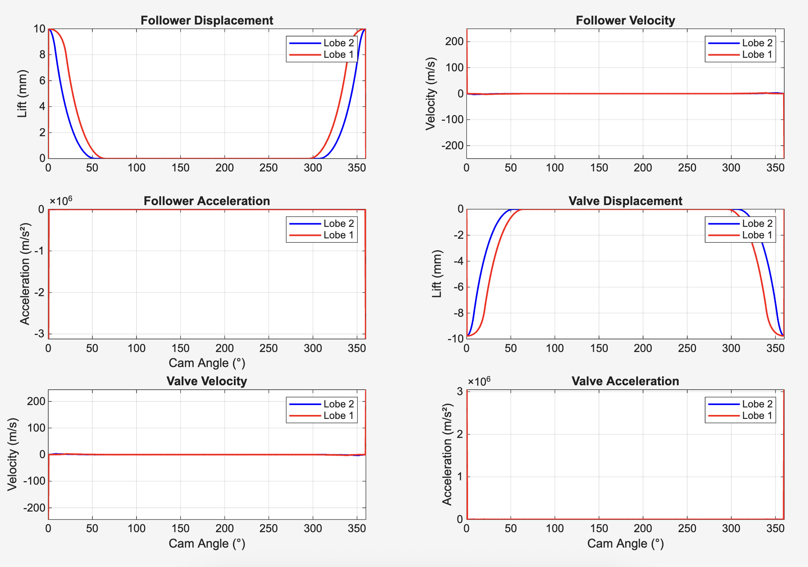

# Two Independent Cam Lobes Analysis

This MATLAB script generates **two independent cam lobes** with separate elliptical profiles sharing a common base circle, then performs complete **kinematic/dynamic analysis** of follower and valve motion at 1000 RPM.

## Features

- Generates two cam lobes with **different profiles** (Lobe 1: ±64.6°, Lobe 2: ±53.1°)
- **Geometric tangent construction** from base circle to ellipse
- Full **360° lift curves** for both lobes
- Complete **follower + valve dynamics** (displacement, velocity, acceleration)
- **Rocker arm ratio** (37.4/38.3) applied to valve motion
- Automatic plotting + **summary table** of maximum values

## How to Run

1. Open `marchinery_s.m` in MATLAB
2. Run the script (all plots and analysis auto-generated)
3. Adjust parameters in the top sections if needed:
   - `R_base`: Base circle radius (20 mm)
   - `a1,b1,a2,b2`: Ellipse dimensions for each lobe
   - `theta_start1/2`: Angular span for each lobe
   - `omega_val`: Engine speed (1000 RPM default)
   - `ratio`: Rocker arm ratio

## Parameter Summary

| Parameter    | Lobe 1   | Lobe 2   | Unit |
|--------------|----------|----------|------|
| Angular Span | ±64.6°   | ±53.1°   | deg  |
| Ellipse a    | 10 mm    | 5 mm     | mm   |
| Ellipse b    | 5 mm     | 5 mm     | mm   |
| Base Circle  | 20 mm    | 20 mm    | mm   |

## Generated Plots

1. **Cam Geometry**: Lobe profiles (green = Lobe 1, cyan = Lobe 2)
2. **Lift vs Cam Angle**: Complete 360° profiles for both lobes
3. **6-Panel Dynamics**: Follower/valve displacement, velocity, acceleration

## Sample Output @ 1000 RPM

